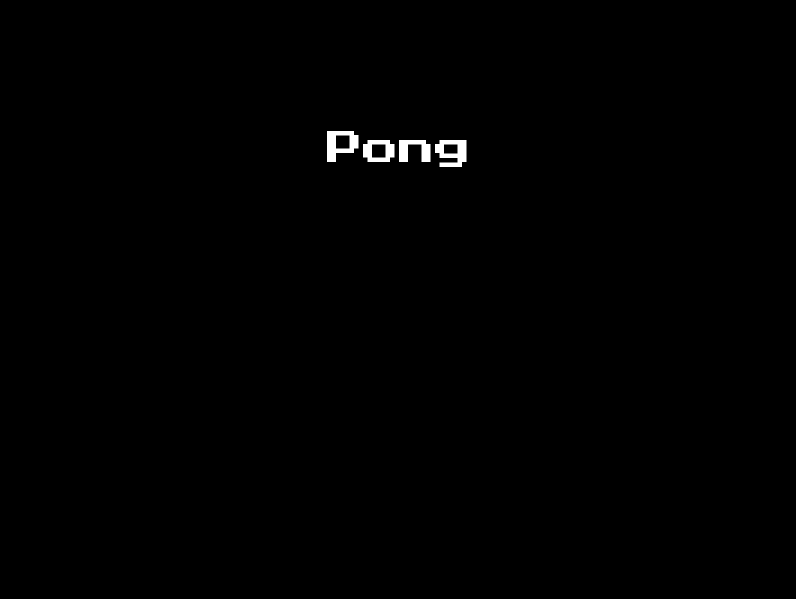
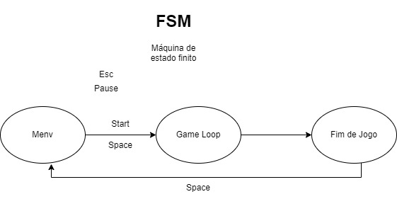

# Ping Pong com Pygames

### - O Jogo vai ficar assim.
<!--Target-->
<p align="center">

</p>
### - Criar um executável
```python
# Instalar o pacote pyInstaller
pyinstaller --onefile ping-pong.py
```


# Set das variáveis
```python
import pygame
from pygame import mixer
import sys

# O código abaixo utiliza a biblioteca Pygame para inicializar dois módulos: pygame e mixer.
# A função pygame.init() é responsável por inicializar todos os módulos do Pygame.
# A função mixer.init() é utilizada para inicializar o módulo mixer do Pygame.
pygame.init()
mixer.init()

# Esse código define algumas constantes e variáveis relacionadas ao jogo
SCREEN_WIDTH =800
SCREEN_HEIGHT = 600
PADDLE_WIDTH = 10
PADDLE_HEIGHT = 60
BALL_SIZE = 10
PADDLE_SPEED = 4
BALL_SPEED = 5

# Esse código define as cores do jogo
WHITE = (255,255,255)
BLACK = (0,0,0)

# Esse código define algumas variáveis relacionadas a fontes, pontuação e sons do jogo.
font_file = "add path"
font = pygame.font.Font(font_file, 36)
score_a = 0
score_b = 0

mixer.music.load("add path")
mixer.music.set_volume(0.3)
collision_sound_A = mixer.Sound("add path")
collision_sound_B = mixer.Sound("add path")
point_sound = mixer.Sound("add path")

mixer.music.play(-1) # Reproduzir a música carregada.
screen = pygame.display.set_mode((SCREEN_WIDTH,SCREEN_HEIGHT)) # Cria uma janela de exibição para o jogo usando a biblioteca Pygame
pygame.display.set_caption("Pong") # define o título da janela de exibição do jogo.


# Essas linhas de código estão criando objetos do tipo pygame.Rect para representar as raquetes e a bola do jogo.
paddle_a = pygame.Rect(20, SCREEN_HEIGHT // 2 - PADDLE_HEIGHT//2, PADDLE_WIDTH, PADDLE_HEIGHT)
paddle_b = pygame.Rect(SCREEN_WIDTH - 20 - PADDLE_WIDTH, SCREEN_HEIGHT // 2 - PADDLE_HEIGHT//2, PADDLE_WIDTH, PADDLE_HEIGHT)
ball =  pygame.Rect(SCREEN_WIDTH //2 - BALL_SIZE // 2, SCREEN_HEIGHT // 2 - BALL_SIZE//2, BALL_SIZE, BALL_SIZE)
ball_dx, ball_dy = BALL_SPEED, BALL_SPEED

```

# Renderização do Menu


```python
def main_menu():
    while True:
        for event in pygame.event.get():
            if event.type == pygame.QUIT:
                pygame.quit()
                sys.exit()

            if event.type == pygame.KEYDOWN:
                if event.key == pygame.K_SPACE:
                    game_loop()
                elif event.key == pygame.K_ESCAPE:
                    pygame.quit()
                    sys.exit()

        # Renderização do menu principal
        screen.fill(BLACK)
        title_font = pygame.font.Font(font_file, 36)  # Configuração da Fonte
        title_text = title_font.render("Pong", True, WHITE)
        title_rect = title_text.get_rect(center=(SCREEN_WIDTH // 2, SCREEN_HEIGHT // 4))

        screen.blit(title_text, title_rect) # UsadO para desenhar um texto na tela do jogo.

        title_font = pygame.font.Font(font_file, 16)
        current_time = pygame.time.get_ticks() # Usada para obter o tempo decorrido desde o início do jogo em milissegundos.

        if current_time % 2000 < 1000:
            title_text1 = title_font.render("Pressione espaço para iniciar", True, WHITE)
            title_rect1 = title_text1.get_rect(center=(SCREEN_WIDTH // 2, SCREEN_HEIGHT // 4 + 60)) # Está definindo um retângulo para posicionar o texto na tela.
            screen.blit(title_text1, title_rect1) # É utilizada para desenhar o texto na tela do jogo, utilizando a superfície de texto

        
        pygame.display.flip()
```

#### Explicação da Estrutura a seguir:

```python
    while True:
        for event in pygame.event.get():
            if event.type == pygame.QUIT:
                pygame.quit()
                sys.exit()

            if event.type == pygame.KEYDOWN:
                if event.key == pygame.K_SPACE:
                    game_loop()
                elif event.key == pygame.K_ESCAPE:
                    pygame.quit()
                    sys.exit()
```
<blockquote style="background-color: #E6F0F7;">

Trata-se de uma estrutura prática usada por desenvolvedores de jogos ao utilizar a biblioteca Pygame.

Essa estrutura envolve a criação de um loop principal, geralmente com a condição while True, que continua executando indefinidamente até que uma condição de término seja alcançada. Dentro desse loop principal, são verificados os eventos do jogo em um loop for, permitindo capturar interações do jogador, como fechar a janela ou pressionar teclas específicas. Esses eventos são processados para atualizar o estado do jogo, como movimentar personagens, verificar colisões, atualizar a lógica do jogo e redesenhar a tela.

Essa estrutura é comumente usada para criar jogos interativos, permitindo que o jogo responda às ações do jogador em tempo real. É uma parte essencial do desenvolvimento de jogos com o Pygame, pois permite o controle do fluxo do jogo e a interação com o usuário.

</blockquote>


<blockquote style="background-color: #E6F0F7;">

Podemos ver que esse bloco funciona da seguinte forma:

```python
current_time = pygame.time.get_ticks()
```
A função é chamada para obter o tempo em milissegundos desde que o jogo começou.

```python
if current_time % 2000 < 1000:
```
O trecho de código verifica se o resto da divisão da variável current_time por 2000 é menor que 1000. Essa condição é utilizada para criar um efeito piscante.

A ideia é que o texto seja exibido apenas durante a primeira metade de cada intervalo de 2000 milissegundos. Se o valor de current_time estiver dentro do intervalo de 0 a 999 milissegundos após cada múltiplo de 2000 milissegundos, o resto da divisão será menor que 1000 e a condição será verdadeira.

Por exemplo, se current_time for 2500, o resto da divisão por 2000 será 500. Como 500 é menor que 1000, a condição será verdadeira e o código dentro do bloco if será executado. Isso resultará na renderização do texto desejado. O efeito piscante é criado porque o texto só será mostrado durante a primeira metade de cada intervalo de 2000 milissegundos. Após esse período, o texto deixará de ser exibido até que a condição seja atendida novamente.

</blockquote>

# Game

```python
def game_loop():
    global ball_dx, ball_dy, score_a, score_b, ball # Declara que as variáveis ball_dx, ball_dy, score_a, score_b e ball serão usadas como variáveis globais.

    while True:
        for event in pygame.event.get():
            if event.type == pygame.QUIT:
                pygame.quit()
                sys.exit()
            if event.type == pygame.KEYDOWN:
                if event.key == pygame.K_ESCAPE:
                    return

        # Essas linhas de código são responsáveis por desenhar diferentes formas na tela do jogo utilizando a biblioteca Pygame.
        screen.fill(BLACK) 
        pygame.draw.rect(screen, WHITE, paddle_a)
        pygame.draw.rect(screen, WHITE, paddle_b)
        pygame.draw.ellipse(screen, WHITE, ball)
        pygame.draw.aaline(screen, WHITE, (SCREEN_WIDTH // 2, 0), (SCREEN_WIDTH // 2, SCREEN_HEIGHT))

        # Utilizada para obter o estado atual de todas as teclas do teclado.
        keys = pygame.key.get_pressed()

        #Movimento Vertical Raquete A
        if keys[pygame.K_w] and paddle_a.top > 0:
            paddle_a.y -= PADDLE_SPEED
        if keys[pygame.K_s] and paddle_a.bottom < SCREEN_HEIGHT:
            paddle_a.y += PADDLE_SPEED

        #Movimento Vertical Raquete B
        if keys[pygame.K_UP] and paddle_b.top > 0:
            paddle_b.y -= PADDLE_SPEED
        if keys[pygame.K_DOWN] and paddle_b.bottom < SCREEN_HEIGHT:
            paddle_b.y += PADDLE_SPEED

        #Movimento Horizontal Raquete A
        if keys[pygame.K_a] and paddle_a.left > 0:
            paddle_a.x -= PADDLE_SPEED
        if keys[pygame.K_d] and paddle_a.right < SCREEN_WIDTH // 2 - 70:
            paddle_a.x += PADDLE_SPEED

        # Movimento Vertical Paddle B
        if keys[pygame.K_UP]:
            self.paddle_b.movey(-self.PADDLE_SPEED)
        if keys[pygame.K_DOWN]:
            self.paddle_b.movey(self.PADDLE_SPEED)

        # Movimento Horizontal Paddle B
        if keys[pygame.K_LEFT] and self.paddle_b.left > self.SCREEN_WIDTH // 2 + 70:
            self.paddle_b.movex(-self.PADDLE_SPEED)
        if keys[pygame.K_RIGHT] and self.paddle_b.right < self.SCREEN_WIDTH:
            self.paddle_b.movex(self.PADDLE_SPEED)
      
        # Atualização da posição da bola
        ball.x += ball_dx
        ball.y += ball_dy


        if ball.colliderect(paddle_a):
            ball.left = paddle_a.right
            ball_dx = -ball_dx
            collision_sound_A.play()

        elif ball.colliderect(paddle_b):
            ball.right = paddle_b.left
            ball_dx = -ball_dx
            collision_sound_B.play()

        # Bola bater em cima e embaixo
        if self.ball.top <= 0 or self.ball.bottom >= self.SCREEN_HEIGHT:
            self.ball.reverse_dy()

        # Atualizar pontuação
        if self.ball.left <= 0:
            self.score_b += 1
            self.reset_ball()
            #print(f"Score B: {self.score_b}")
            self.point_sound.play()
            if self.score_b == 10:
                self.end_game(False)

        elif self.ball.right >= self.SCREEN_WIDTH:
            self.score_a += 1
            self.reset_ball()
            #print(f"Score A: {self.score_a}")
            self.point_sound.play()
            if self.score_a == 10:
                self.end_game(True)


        #Bola quando bate na extremidade da tela
        if ball.top <= 0 or ball.bottom >= SCREEN_HEIGHT:
            ball_dy = -ball_dy

        #Ponto para o Time B
        if ball.left <= 0:
            score_b += 1
            ball.x = SCREEN_WIDTH // 2 - BALL_SIZE // 2
            ball.y = SCREEN_HEIGHT // 2 - BALL_SIZE // 2
            ball_dx = -ball_dx
            point_sound.play()
            # print(score_b)
            if score_b == 10: #Comente
                end_game(False)

        #Ponto para o Time A
        elif ball.right >= SCREEN_WIDTH:
            score_a += 1
            ball.x = SCREEN_WIDTH // 2 - BALL_SIZE // 2
            ball.y = SCREEN_HEIGHT // 2 - BALL_SIZE // 2
            ball_dx = -ball_dx
            point_sound.play()
            # print(score_a)
            if score_a == 10: #Comente
                end_game(True)

        # Placar na Tela
        score_text = font.render(f"{score_a}  {score_b}", True, WHITE)
        score_rect = score_text.get_rect(center=(SCREEN_WIDTH // 2, 30))
        screen.blit(score_text, score_rect)

        # Atualizar a tela
        pygame.display.flip()

        # Controlar FPS
        clock = pygame.time.Clock()
        clock.tick(60)
```

<blockquote style="background-color: #EAB8AD;">

```
# Movimento Vertical Raquete A - 

# Nesse trecho de código, está sendo verificado se as teclas "w" e "s" estão pressionadas (keys[pygame.K_w] e keys[pygame.K_s], respectivamente) e se a posição da raquete A permite que ela se mova para cima ou para baixo.

        if keys[pygame.K_w] and paddle_a.top > 0:
            paddle_a.y -= PADDLE_SPEED
        if keys[pygame.K_s] and paddle_a.bottom < SCREEN_HEIGHT:
            paddle_a.y += PADDLE_SPEED
```

</blockquote>

<blockquote style="background-color: #EAB8AD;">


```
# Movimento Horizontal Raquete A - 

# Nesse trecho de código, está sendo verificado se as teclas "a" e "d" estão pressionadas (keys[pygame.K_a] e keys[pygame.K_d], respectivamente) e se a posição da raquete A permite que ela se mova para a esquerda ou para a direita.

        if keys[pygame.K_a] and self.paddle_a.left > 0:
                self.paddle_a.movex(-self.PADDLE_SPEED)
        if keys[pygame.K_d] and self.paddle_a.right < self.SCREEN_WIDTH // 2 - 70:
                self.paddle_a.movex(self.PADDLE_SPEED)
```

</blockquote>

<blockquote style="background-color: #EAB8AD;">

O sistema de colisão verifica se a bola colide com as raquetes A e B, bem como as bordas superior e inferior da tela.
Se a bola colidir com a raquete A, sua direção horizontal é invertida e um som de colisão é reproduzido. O mesmo ocorre se a bola colidir com a raquete B.
Se a bola atingir as bordas superior ou inferior da tela, sua direção vertical é invertida.
Se a bola ultrapassar as bordas laterais da tela, um ponto é marcado para o jogador correspondente, a bola é reposicionada e sua direção horizontal é invertida. Se um jogador atingir a pontuação máxima, o jogo é encerrado.
Isso resume a lógica básica de colisão no jogo Pong implementado nesse código.

</blockquote>

<blockquote style="background-color: #EAB8AD;">


```
# Sistema de Pontuação do Game - 

# Neste trecho de código, ocorre a verificação dos pontos marcados pelos jogadores quando a bola ultrapassa as bordas laterais da tela.
# Em resumo, esse trecho de código trata da contagem de pontos, reinicialização da bola, reprodução de som e renderização da pontuação durante o jogo Pong.

        if self.ball.left <= 0:
                self.score_b += 1
                self.reset_ball()
                #print(f"Score B: {self.score_b}")
                self.point_sound.play()
                if self.score_b == 10:
                    self.end_game(False)

            elif self.ball.right >= self.SCREEN_WIDTH:
                self.score_a += 1
                self.reset_ball()
                #print(f"Score A: {self.score_a}")
                self.point_sound.play()
                if self.score_a == 10:
                    self.end_game(True)

            self.score_text = self.font.render(f"{self.score_a}  {self.score_b}", True, self.WHITE)
            self.score_rect = self.score_text.get_rect(center=(self.SCREEN_WIDTH // 2, 30))
            self.screen.blit(self.score_text, self.score_rect)

```

</blockquote>

#Fim de Jogo

```python
def end_game(winner): 
    while True:
        for event in pygame.event.get():
            if event.type == pygame.QUIT:
                pygame.quit()
                sys.exit()
            if event.type == pygame.KEYDOWN:
                if event.key == pygame.K_SPACE:
                    reset_game()
                    return
                elif event.key == pygame.K_ESCAPE:
                    pygame.quit()
                    sys.exit()

       
        mixer.music.stop()
        screen.fill(BLACK)
        #Comente
        if winner:
            winner_text = "Player 2 Wins!"
        else:
            winner_text = "Player 1 Wins!"

        # Renderização da tela de fim de jogo
        winner_font = pygame.font.Font(font_file, 36)
        winner_render = winner_font.render(winner_text, True, WHITE)
        winner_rect = winner_render.get_rect(center=(SCREEN_WIDTH // 2, SCREEN_HEIGHT // 4))
        screen.blit(winner_render, winner_rect)
        pygame.display.flip()
```
<blockquote style="background-color: #EAB8AD;">

A função *end_game(winner)* é responsável por exibir a tela de fim de jogo no Pong. Ela é chamada quando um dos jogadores alcança a pontuação máxima e vence a partida. A

</blockquote>

# Reiniciando o Jogo
```python
def reset_game():
    global paddle_a, paddle_b, ball, ball_dx, ball_dy, score_a, score_b

    paddle_a = pygame.Rect(20, SCREEN_HEIGHT // 2 - PADDLE_HEIGHT // 2, PADDLE_WIDTH, PADDLE_HEIGHT)
    paddle_b = pygame.Rect(SCREEN_WIDTH - 20 - PADDLE_WIDTH, SCREEN_HEIGHT // 2 - PADDLE_HEIGHT // 2, PADDLE_WIDTH, PADDLE_HEIGHT)
    ball = pygame.Rect(SCREEN_WIDTH // 2 - BALL_SIZE // 2, SCREEN_HEIGHT // 2 - BALL_SIZE // 2, BALL_SIZE, BALL_SIZE)
    ball_dx, ball_dy = BALL_SPEED, BALL_SPEED
    score_a, score_b = 0, 0
```

<blockquote style="background-color: #EAB8AD;">

O código apresentado define uma função chamada reset_game() que é responsável por reiniciar as variáveis relacionadas ao jogo Pong.

</blockquote>

### - FSM
<!--Target-->
<p align="center">

</p>
    
### - Arquivo Executável

O arquivo executável do jogo se encontra na pasta /dist
